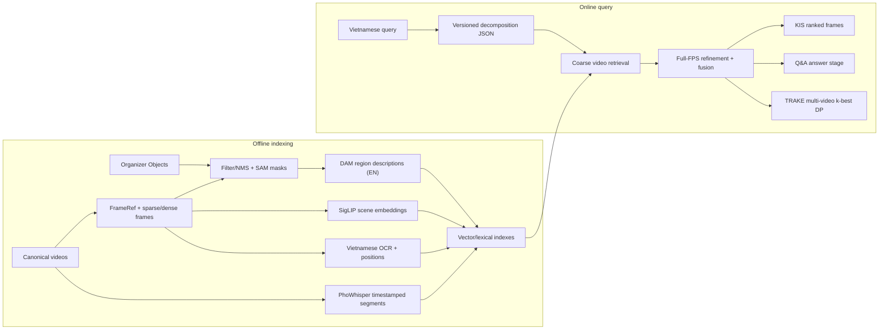

# AIC 2026 - Video Retrieval Pipeline

Repo dùng chung của team cho vòng Sơ tuyển AI Challenge 2026 TP.HCM. Thiết kế ưu
tiên chạy trên **Google Colab/Kaggle**, tái lập bằng CLI, và cho phép mỗi thành viên
phát triển một modality mà không phụ thuộc notebook của người khác.

Hiện tại code tập trung vào nhánh đã được giao:

```text
organizer Objects (bbox/class/score)
  -> filter + deduplicate
  -> SAM bbox-to-mask refinement
  -> DAM localized English description
  -> versioned ObjectFrameRecord JSONL + RunManifest
```

SigLIP, Vietnamese OCR, PhoWhisper, query parser, fusion, Q&A và TRAKE alignment là
kiến trúc đã thống nhất nhưng chưa được coi là implemented cho đến khi subsystem
owner thêm code, model pin, validator và test.

### Ownership tạm thời

| Component | Trách nhiệm | Review bắt buộc |
|---|---|---|
| Contracts, configs, evaluation | Repo admin cho đến khi có GitHub handles | Mọi schema/model/scoring change |
| Organizer Objects → SAM → DAM | Object-description owner | Output schema hoặc model revision |
| SigLIP2 và retrieval/fusion | Retrieval owner | Index contract và calibration |
| Vietnamese OCR | OCR owner | Text/polygon contract |
| PhoWhisper ASR | ASR owner | Segment/timestamp contract |
| Colab, Kaggle, CI | Infra owner | Dependency hoặc runner interface |

Mỗi component cần một primary và một backup trước khi bật `CODEOWNERS`. Trong lúc
chưa có handles thật, branch protection và một non-author approval là rule áp dụng.

## 1. Mục tiêu đề thi và hệ quả thiết kế

Theo tài liệu vòng Sơ tuyển:

- Hệ thống xử lý **KIS**, **Q&A** và **TRAKE**; mỗi query nộp tối đa 100 answers.
- Final score là trung bình `R@1`, `R@5`, `R@20`, `R@50`, `R@100`.
- KIS/Q&A chỉ được tính khi đúng tổ hợp video-frame; Q&A còn phải đúng answer.
- TRAKE chọn sai video nhận 0; khi đúng video, recall là tỷ lệ event frames khớp.
  Ground-truth event windows thường hẹp, dưới khoảng 10 frames.
- Video gốc là canonical source. Keyframes, Objects và CLIP features do ban tổ
  chức cung cấp là dữ liệu hỗ trợ, không thay thế full-video refinement.

Vì vậy pipeline phải giữ timestamp/frame identity chính xác, tìm video ở coarse
stage rồi refine full FPS, và dùng temporal NMS/diversification để không lãng phí
top-100 bằng nhiều frames kề nhau. Tối ưu chỉ `R@100` hoặc chỉ keyframes đều không
đủ; cần precision đầu bảng lẫn coverage ở mọi cutoff.

## 2. Kiến trúc tổng thể



Chi tiết data flow, failure policy và scoring rationale nằm trong
[`docs/architecture.md`](docs/architecture.md). Contract chính thức nằm trong
[`docs/data-contracts.md`](docs/data-contracts.md).

### Offline

1. Ingest video và organizer map-keyframes để tạo stable `FrameRef` gồm
   `video_id`, `frame_idx`, `pts_time_s`, `fps`, relative image path và kích thước.
2. Dùng keyframes/coarse embeddings để phủ toàn corpus; chỉ giải mã hoặc embed
   full FPS cho candidate videos/segments cần refine.
3. Với object branch v1, đọc organizer bbox/class/score; lọc confidence/area,
   NMS/deduplicate, dùng SAM biến bbox thành mask, rồi DAM mô tả từng region bằng
   tiếng Anh tối đa 20 words. Giữ cả bbox, mask RLE, detector metadata và status.
4. SigLIP2 mã hóa toàn cảnh frame. OCR lưu literal Vietnamese text cùng polygon/
   bbox. PhoWhisper lưu segment transcript với `[start_ms, end_ms]`.
5. ASR dùng cửa sổ 30 giây, stride 15 giây, nhưng không copy transcript vào mọi
   frame. Online join segment với frame timestamp để tránh phình index và score lặp giả.
6. Mỗi stage publish JSONL/index atomically và kèm `RunManifest`: resolved config,
   Git SHA, model revisions, input hashes, seed, runtime và counters.

### Online

Fixed few-shot prompt chuyển raw Vietnamese query thành `aic26.query.v1`:

```json
{
  "schema_version": "aic26.query.v1",
  "task_type": "kis | qa | trake",
  "raw_query_vi": "...",
  "scene_en": "one holistic English sentence",
  "objects_en": ["one object/person plus visual attributes per item"],
  "ocr_vi": ["literal written Vietnamese strings only"],
  "audio_vi": ["literal spoken Vietnamese phrases only"],
  "audio_events_en": [],
  "question_vi": null,
  "question_en": null,
  "answer_sources": [],
  "events": null
}
```

Quy tắc bất biến: `scene_en` là **một string** cho SigLIP; mỗi
`objects_en[i]` là **một query riêng** đối với DAM regions; `ocr_vi`/`audio_vi`
giữ nguyên tiếng Việt và chỉ có khi query nêu literal written/spoken content. Không
dịch hai field này và không tự suy diễn.

Prompt cố định và đủ four few-shot examples nằm tại
[`docs/query-decomposition.md`](docs/query-decomposition.md).

Điểm khởi đầu cho fusion:

```text
S = w_scene*S_scene + w_object*S_object + w_ocr*S_ocr + w_audio*S_audio
```

Modality không được query đề cập có weight 0; phần còn lại renormalize. Scene dùng
cosine SigLIP2. Mỗi `objects_en[i]` là một slot riêng; object score dùng maximum-weight
one-to-one assignment giữa query slots và regions, nên một bbox không được thỏa nhiều
object khác nhau. OCR/ASR dùng literal/fuzzy/BM25 tiếng Việt. Mọi score phải được
calibrate trên validation trước khi cộng.

- KIS: coarse video search -> dense frame rerank -> temporal NMS -> tối đa 100
  `(video_id, frame_idx)`.
- Q&A: retrieval như KIS; answer model nhận `question_en` cùng visual context,
  DAM captions, OCR và ASR gần timestamp. `question_en` không đi vào index.
- TRAKE: top-level query tìm **nhiều** candidate videos. Mỗi event tạo một score
  curve dense trong từng video; k-best DP chọn `t1 < ... < tn`, rồi merge/rank các
  sequences giữa videos. Không khóa vào đúng một video quá sớm.

## 3. Chạy object -> bbox/mask -> DAM trên cloud

### Data layout cần cung cấp

Repo không chứa dữ liệu cuộc thi. Mỗi video cần:

- map CSV với đúng columns `n,pts_time,fps,frame_idx`;
- keyframe image directory, filename stem là `n`;
- organizer object JSON directory, cùng numbering với keyframes.

Ba runtime roots luôn truyền qua env hoặc CLI:

```text
AIC_DATA_ROOT      source data read-only
AIC_ARTIFACT_ROOT  generated JSONL/manifests
AIC_CACHE_ROOT     model snapshots/cache
```

Các path ví dụ bên dưới là **platform setup placeholders**; sửa chúng theo nơi
team mount data. Runner code không chứa `/content`, `/kaggle` hay path máy cá nhân.

### Google Colab

Cell 1 - mount Drive, lấy token read-only từ Colab Secrets và clone private repo.
Không paste token vào cell:

```python
from google.colab import drive, userdata
import os, subprocess

drive.mount("/content/drive")
token = userdata.get("AIC_GITHUB_TOKEN")
clone_env = os.environ.copy()
clone_env.update({
    "GIT_CONFIG_COUNT": "1",
    "GIT_CONFIG_KEY_0": "http.https://github.com/.extraheader",
    "GIT_CONFIG_VALUE_0": f"Authorization: Bearer {token}",
})
subprocess.run(
    ["git", "clone", "https://github.com/AIVIETNAM-AIO-Dewey/AIC-2026.git", "/content/AIC-2026"],
    env=clone_env,
    check=True,
)
del token, clone_env
os.chdir("/content/AIC-2026")
```

Cell 2 - đặt paths bền qua các `%%bash` cells:

```python
%env AIC_DATA_ROOT=/content/drive/MyDrive/AIC2026/data
%env AIC_ARTIFACT_ROOT=/content/drive/MyDrive/AIC2026/artifacts
%env AIC_CACHE_ROOT=/content/aic2026-cache
%env AIC_VIDEO_ID=replace_with_video_id
```

Cell 3 - install và preflight:

```bash
%%bash
set -euo pipefail
python -m pip install --no-deps -r requirements/colab.txt
python scripts/verify_environment.py \
  --config configs/offline/object_description.yaml \
  --device cuda --write-report
```

Cell 4 - chạy full object branch cho một video:

```bash
%%bash
set -euo pipefail
FRAME_MANIFEST="$AIC_ARTIFACT_ROOT/frame_manifests/$AIC_VIDEO_ID.jsonl"
MASK_ARTIFACT="$AIC_ARTIFACT_ROOT/object_description/masks/$AIC_VIDEO_ID.jsonl"
DESCRIPTION_ARTIFACT="$AIC_ARTIFACT_ROOT/object_description/descriptions/$AIC_VIDEO_ID.jsonl"
MAP_CSV="$AIC_DATA_ROOT/map-keyframes/$AIC_VIDEO_ID.csv"
FRAMES_DIR="$AIC_DATA_ROOT/keyframes/$AIC_VIDEO_ID"
OBJECTS_DIR="$AIC_DATA_ROOT/objects/$AIC_VIDEO_ID"

python scripts/build_frame_manifest.py \
  --config configs/offline/object_description.yaml \
  --video-id "$AIC_VIDEO_ID" \
  --map-csv "$MAP_CSV" \
  --frames-dir "$FRAMES_DIR" \
  --output "$FRAME_MANIFEST" --resume

python scripts/prepare_object_masks.py \
  --config configs/offline/object_description.yaml \
  --video-id "$AIC_VIDEO_ID" \
  --frame-manifest "$FRAME_MANIFEST" \
  --objects-dir "$OBJECTS_DIR" \
  --device cuda --resume

python scripts/run_dam_descriptions.py \
  --config configs/offline/object_description.yaml \
  --video-id "$AIC_VIDEO_ID" \
  --mask-artifact "$MASK_ARTIFACT" \
  --device cuda --resume

python scripts/validate_object_artifacts.py \
  --artifact "$DESCRIPTION_ARTIFACT" \
  --manifest "${DESCRIPTION_ARTIFACT%.jsonl}.manifest.json" \
  --require-captions
```

`scripts/*` tự đọc ba `AIC_*_ROOT`; có thể truyền explicit
`--data-root/--output-root/--cache-root` để override. Smoke test phải dùng một
`AIC_ARTIFACT_ROOT` riêng (ví dụ `.../smoke`) và `--limit 2`; không resume full run
từ artifact có giới hạn vì config hash cố ý không tương thích.

### Kaggle

Cell 1 - Internet-on clone bằng Kaggle Secret `AIC_GITHUB_TOKEN`; Internet-off
copy source snapshot từ private Dataset. Notebook mẫu tự chọn nhánh phù hợp:

```python
from pathlib import Path
import os, shutil, subprocess

source = Path("/kaggle/input/aic2026-source/AIC-2026")
target = Path("/kaggle/working/AIC-2026")
if source.is_dir():
    shutil.copytree(source, target, dirs_exist_ok=True)
else:
    from kaggle_secrets import UserSecretsClient
    token = UserSecretsClient().get_secret("AIC_GITHUB_TOKEN")
    clone_env = os.environ.copy()
    clone_env.update({
        "GIT_CONFIG_COUNT": "1",
        "GIT_CONFIG_KEY_0": "http.https://github.com/.extraheader",
        "GIT_CONFIG_VALUE_0": f"Authorization: Bearer {token}",
    })
    subprocess.run(["git", "clone", "https://github.com/AIVIETNAM-AIO-Dewey/AIC-2026.git", str(target)], env=clone_env, check=True)
    del token, clone_env
os.chdir(target)
```

Cell 2 - sửa Dataset slug/video ID theo attachment của team:

```python
%env AIC_DATA_ROOT=/kaggle/input/aic2026-data
%env AIC_ARTIFACT_ROOT=/kaggle/working/aic2026-artifacts
%env AIC_CACHE_ROOT=/kaggle/working/aic2026-model-cache
%env AIC_VIDEO_ID=replace_with_video_id
```

Cell 3 - install/preflight dùng `requirements/kaggle.txt`, sau đó chạy đúng Cell 4
của Colab:

```bash
%%bash
set -euo pipefail
python -m pip install --no-deps -r requirements/kaggle.txt
python scripts/verify_environment.py \
  --config configs/offline/object_description.yaml \
  --device cuda --write-report
```

Kaggle Internet-off dùng `requirements/kaggle-offline.txt`, pinned DAM wheel và
Hugging Face cache snapshot từ private Dataset; xem lệnh checksum cụ thể trong
[`docs/cloud-runbook.md`](docs/cloud-runbook.md).

Khi Kaggle Internet tắt, attach private Dataset chứa model snapshots đúng revisions
trong `configs/models.yaml` và trỏ `AIC_CACHE_ROOT` vào snapshot read-only hoặc copy
sang `/kaggle/working`. Không fallback sang `main`.

Thin notebooks tương ứng: [`notebooks/colab_object_description.ipynb`](notebooks/colab_object_description.ipynb)
và [`notebooks/kaggle_object_description.ipynb`](notebooks/kaggle_object_description.ipynb).

## 4. Output và validation

Với `VIDEO_ID`, outputs cố định:

```text
frame_manifests/<VIDEO_ID>.jsonl
object_description/masks/<VIDEO_ID>.jsonl
object_description/descriptions/<VIDEO_ID>.jsonl
```

Mỗi stage manifest đổi suffix `.jsonl` thành `.manifest.json`. Description JSONL
dùng schema `aic26.object_regions.v1`; mỗi region giữ organizer detection, bbox
normalized + pixel half-open, SAM/bbox-fallback mask RLE và caption status. Missing
frame, duplicate ID, bbox/mask ngoài ảnh hoặc manifest không tương thích là hard
failure. Shard description chỉ publish khi mọi caption `ok`; lỗi/OOM giữ `.partial`
để `--resume` retry, và primary OOM retry được ghi trong manifest counters.

## 5. Cấu trúc repo

```text
configs/       immutable model registry và pipeline defaults
docs/          architecture, contracts, cloud/model runbooks
notebooks/     thin Colab/Kaggle launchers, không chứa pipeline logic
scripts/       CLI entry points
src/aic2026/   reusable implementation và strict contracts
tests/         CPU tests + tiny licensed fixtures
data/          organizer data mount (ignored)
artifacts/     generated outputs (ignored)
runs/          run metadata (ignored)
```

## 6. Làm việc nhóm, reproducibility và license

- Một shared private repo, `main` protected, nhánh ngắn hạn, squash merge, ít nhất
  một reviewer; contract/config/model changes cần subsystem owner review.
- Không commit data, media, weights, embeddings, submissions, notebook outputs,
  local paths hoặc secrets. Xem [`CONTRIBUTING.md`](CONTRIBUTING.md) và
  [`SECURITY.md`](SECURITY.md).
- DVC chưa bắt buộc. V1 dùng private cloud storage + manifests/checksums; chỉ thêm
  DVC khi team chốt private remote và cần version derived datasets.
- SAM weights/code là Apache-2.0. DAM source code là Apache-2.0 nhưng DAM weights
  dùng NVIDIA Noncommercial License. Phải xác nhận tính phù hợp với điều lệ cuộc
  thi trước production; xem [`docs/model-registry.md`](docs/model-registry.md).
- Repo chưa khai báo open-source `LICENSE`; không được suy ra quyền phân phối code,
  organizer data hoặc third-party weights cho đến khi team/ban tổ chức chốt.

CPU checks dành cho development/PR, không chạy model:

```bash
python -m pip install -r requirements/dev.txt
ruff check .
ruff format --check .
pytest -m "not gpu and not slow"
```

Cloud setup, cache, Internet-off và resume policy được mô tả tại
[`docs/cloud-runbook.md`](docs/cloud-runbook.md).
